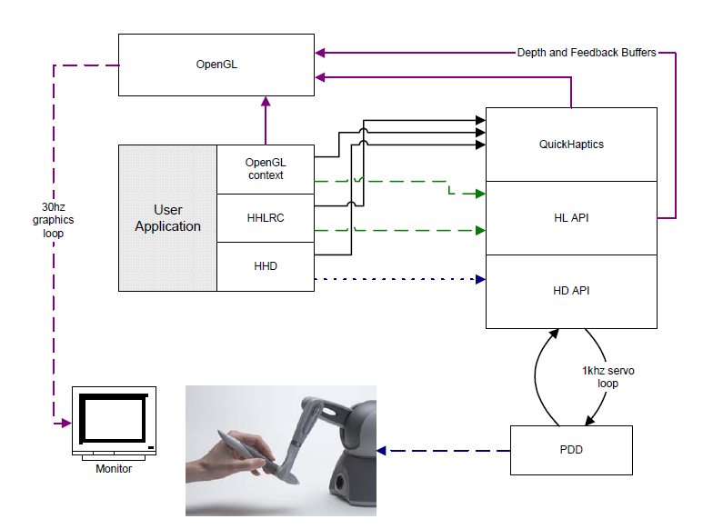
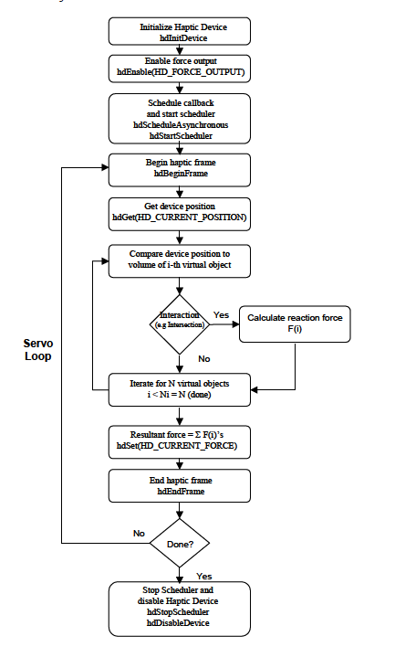
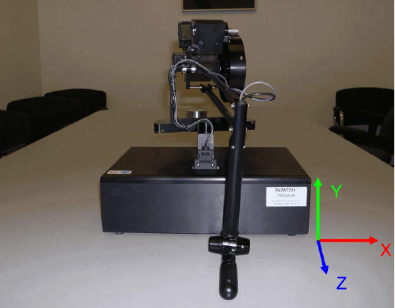

# HLAPI / HDAPI 
HLAPI 用于上层的力反馈渲染，使用和OpenGL相似。HDAPI则偏向底层编程，HLAPI建立在HDAPI基础之上。  
HDAPI必须通过HHD获取力反馈设备handle，在HLAPI中使用HHLRC _(haptic rendering context)_ 。使用`hdEnable()/hdDisable()` 打开或关闭HDAPI中的特性。  
使用`hdEndFrame()`将计算结果提交到力反馈设备上。
  

# use HDAPI
使用HDAPI的基本步骤是：
1. 初始化设备。  
2. 创建scheduler callback _（计算位置和力）_  
3. 使设备输出力  
4. 运行scheduler  
5. clean up!

  
## 初始化设备
```c
HHD hHD = hdInitDevice(HD_DEFAULT_DEVICE); //部分设备需要手动矫正
hdEnable(HD_FORCE_OUTPUT);  //使其可以输出力
hdStartScheduler(); // 对于多设备每个设备都要启动

hdMakeCurrentDevice(hHD); //切换到当前设备

//使用hdBeginFrame()和hdEndFrame()定义设备状态绑定的scope

//定义call back
HDCallbackCode HDCALLBACK DeviceStateCallback(void *pUserData);
//在这个方法中获取设备的信息，例如位置和力

HDCallbackCode HDCALLBACK DeviceStateCallback(void *pUserData)
{
    DeviceDisplayState *pDisplayState =static_cast<DeviceDisplayState *>(pUserData);
    hdGetDoublev(HD_CURRENT_POSITION,
    pDisplayState->position);
    hdGetDoublev(HD_CURRENT_FORCE,
    pDisplayState->force);
    // execute this only once
    return HD_CALLBACK_DONE;
}
```

Scheduler calls 分为两种同步和异步。同步调用只会在其完成时返回，所以主线程需要等待其调用返回，异步调用在执行时可以立即返回。  
·Synchronous call:  
```c
// get the current position of end-effector
DeviceDisplayState state;
hdScheduleSynchronous(DeviceStateCallback,&state,HD_MIN_SCHEDULER_PRIORITY);
```  
·Asynchronous call: 
```c
hdScheduleAsynchronous(AForceSettingCallback,(void*)0,HD_DEFAULT_SCHEDULER_PRIORITY);
```
该函数返回一个handle，该句柄之后可以用于`hdUnschedule`和`blocking`等操作  


## 获取状态
使用`hdGet`系列函数
```c
HDint buttonState;
HDstring vendor;
hduVector3Dd position;
HDfloat velocity[3];
HDdouble transform[16];
hdGetIntegerv(HD_CURRENT_BUTTONS,&buttonState);
hdGetString(HD_DEVICE_VENDOR,vendor);
hdGetDoublev(HD_CURRENT_POSITION,position);
hdGetFloatv(HD_CURRENT_VELOCITY,velocity);
hdGetDoublev(HD_LAST_ENDPOINT_TRANSFORM,transform);
//和OpenGL十分相似
```
## 设置状态
使用`hdSet`系列函数
```c
HDdouble force[3] = {0.5, 0.0, 1.0};
hdSetDoublev(HD_CURRENT_FORCE,force);
HDfloat rampRate = .5;
hdSetFloatv(HD_FORCE_RAMPING_RATE,&rampRate);
```

## 校准
1. 获取设备支持的校准方式  
```c
hdGetIntegerv(HD_CALIBRATION_STYLE, &supportedCalibrationStyles);
```
2. 定义校准回调函数  
```c
HDCallbackCode CalibrationStatusCallback(void *pUserData)
{
    HDenum *pStatus = (HDenum *) pUserData;
    hdBeginFrame(hdGetCurrentDevice());
    *pStatus = hdCheckCalibration();
    hdEndFrame(hdGetCurrentDevice());
    return HD_CALLBACK_DONE;
}
```


## 坐标系



## clean up!
```c
hdStopScheduler();
hdUnschedule(scheduleCallbackHandle);
hdDisableDevice(hdGetCurrentDevice());
```
