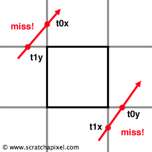

---
layout:     post
title:      碰撞检测算法相关
subtitle:   
date:       2020-03-09
author:     infinityyf
header-img: img/tag-bg-o.jpg
catalog: true
tags:
    - 碰撞检测
---  
# 碰撞检测算法

对于使用三角网格表示的几何体，要做到精确的碰撞检测就需要遍历整个网格定位到发生碰撞的三角形，再进一步计算碰撞点的位置。但是这一方式的计算量过大。因此在常见的碰撞检测算法中通常包含两个阶段（**例如bullet库**），分别是粗检测和精检测。  

## 粗检测阶段

需要快速定位碰撞区域，并略过未发生碰撞的区域。这就需要对几何体进行划分，并且是具有层次的划分。划分的方式通常使用层次包围盒的方式，即使用具有树型结构的包围盒结构对三角面片进行包围（**对于单个物体可以对三角面片进行处理，当物体众多，则需要对整个碰撞空间进行划分，常用的划分的方式为四叉树、八叉树、BVH树、loose八叉树等结构，之后进行详细介绍**）

## 精检测阶段

三角形碰撞的计算（SAT，GJK等算法）

# 包围盒技术

避免复杂三角网格之间碰撞检测计算的复杂性，先使用简单几何体作为包围盒来进行粗略的碰撞检测。

## AABB包围盒

AABB表示(Axis-aligned Bounding Box)，轴对齐碰撞盒。对于AABB包围盒的构造，可以通过获取集合体的最大和最小坐标位置的方式获得。由于包围盒是轴向对齐的，因此只需要比较最小最大位置的坐标是否具有重合即可。以三维空间的物体为例，AABB包围盒可以很方便的用以下数据结构来表述：

```c
class AABB{
    Vec3 min;
    Vec3 max;
};

```

#### AABB包围盒相关算法

1. [射线碰撞检测](https://www.scratchapixel.com/lessons/3d-basic-rendering/minimal-ray-tracer-rendering-simple-shapes/ray-box-intersection)  
用于检测射线是否与包围盒发生相交，参考标题链接中的文章。该方法不仅可以判断是否发生相交，经过修改之后还可以计算相交点的位置。但是一般的碰撞检测只需要返回是否碰撞即可，更精细的求解则发生在三角网格等其他模型上。  
对于直线可以使用 **y=kx+b** 来表示。对于AABB包围盒，我们可以很容易得到包围盒在每个轴上的最小和最大值，分别记为x0,x1,y0,y1,z0,z1。我们其实可以求出射线在每个**轴面**上交点坐标的分量：  

```c
t0x = (x0 - Ox) / kx
t1x = (x1 - Ox) / kx
t0y = (y0 - Oy) / ky
t1y = (y1 - Oy) / ky
t0z = (z0 - Oz) / kz
t1z = (z1 - Oz) / kz
```

在二维空间表示为：  
  
此时再取t0x,t0y中的较大值，t1x,t1y中的较小值。z值的计算方法相似。对于miss的情况，只需要最最终的到的最大最小值进行判断，若最小值大于最大值则miss：  
  

2. AABB包围盒相交检测
  
```c
bool CollideWithBox(AABB* box){
    //所有不会碰撞的情况
    if (a_box.min.x > max.x) return (false);
    if (a_box.min.y > max.y) return (false);
    if (a_box.min.z > max.z) return (false);
    if (a_box.max.x < min.x) return (false);
    if (a_box.max.y < min.y) return (false);
    if (a_box.max.z < min.z) return (false);
    return (true);
}
```  

## OBB包围盒（以方形为例）

OBB包围盒（oriented bounding box）同样使用方形包围盒对物体进行包裹，但是方向具有任意性，将包围盒尽可能地紧密包围物体。使用SAT（分离轴算法进行包围盒相交运算）。OBB包围盒地定义方法：
中心点c以及一组正交向量，分别表示包围盒位置和朝向,还需要三个标量用于表示长宽高地一半,即:  

```c

struct OBB{
    vec3 center;
    vec3 orientX;
    vec3 orientY;
    vec3 orientZ;
    vec3 size; // half-height half-width half -depth
};

```

所以实际上OBB包围盒相当于一个有朝向地AABB包围盒.

### OBB包围盒相关算法  

1. 包围盒相交检测（常用SAT算法）  

2. 射线相交检测  


## k-dop包围盒

## 凸体包围盒


# 空间划分与场景管理

空间划分技术，和场景管理技术意思相似，都是对空间中的物体进行层次上的划分，使得搜索过程可以快速进行，这是进行粗碰撞检测的关键。一般使用数结构进行描述。

## [AABB树](https://www.azurefromthetrenches.com/introductory-guide-to-aabb-tree-collision-detection/)

对场景中的每一个物体创建一个AABB包围盒，并使用树结构将场景中所有的物体组织起来。除了对场景中每个单独的物体构建包围盒，还可以对单个物体的网格创建包围盒。在定位到相交物体后可以更加精确的定位到相交三角形

# 三角形相交测试

标量判别型的Möller算法
矢量判别型的Devillers算法
